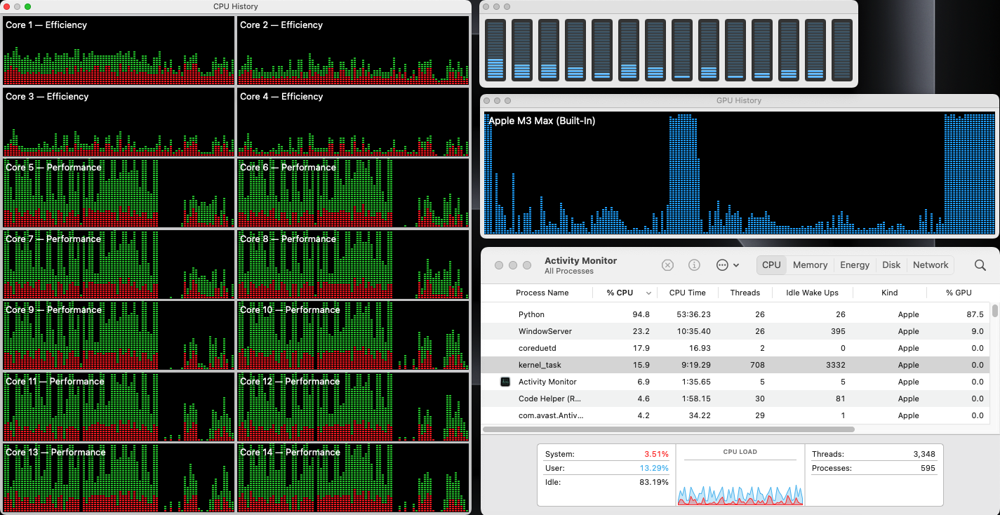

# CPU vs GPU in Machine Learning

## Project Overview
This project focuses on training a digit recognition model using PyTorch and the MNIST dataset. The primary goal is to compare the training performance of the model when executed on two different processing units: the CPU and the GPU (MPS). The model used for training is a Convolutional Neural Network (CNN), which is a popular architecture for image recognition tasks.

## Dataset
The project leverages the MNIST dataset, a well-known benchmark for digit recognition, consisting of 60,000 training images and 10,000 testing images. Each image is a 28x28 grayscale image representing a handwritten digit from 0 to 9. This dataset is ideal for experimenting with machine learning models for classification.

## Methodology
The model was trained using both the CPU and the GPU, and performance measurements were taken to compare the two in terms of training speed. The experiment was conducted by running 5, 10, and 20 epochs on each device. Each training run included timing measurements to observe the difference in performance, with both devices subjected to the same workload.

<table>
        <thead>
            <tr>
                <th></th>
                <th>5 Epochs</th>
                <th>10 Epochs</th>
                <th>20 Epochs</th>
            </tr>
        </thead>
        <tbody>
            <tr>
                <th>CPU</th>
                <td></td>
                <td></td>
                <td></td>
            </tr>
            <tr>
                <th>GPU</th>
                <td></td>
                <td></td>
                <td></td>
            </tr>
        </tbody>
    </table>

The code was structured to measure and output the total training time for each device, and the behavior of the model on both devices was tracked across different epoch counts. To ensure consistency, the model was reset between runs, and the same random seed was used to maintain comparable results across multiple experiments.

<table>
    <thead>
        <tr>
            <th>Stats</th>
            <th>5 Epochs</th>
            <th>10 Epochs</th>
            <th>20 Epochs</th>
        </tr>
    </thead>
    <tbody>
        <tr>
            <td><strong>Time training for CPU</strong></td>
            <td>35.92 seconds</td>
            <td>72.02 seconds</td>
            <td>144.16 seconds</td>
        </tr>
        <tr>
            <td><strong>Time training for GPU</strong></td>
            <td>24.58 seconds</td>
            <td>48.81 seconds</td>
            <td>97.26 seconds</td>
        </tr>
        <tr class="highlight">
            <td><strong>Time saved by GPU</strong></td>
            <td>11.34 seconds</td>
            <td>23.20 seconds</td>
            <td>46.91 seconds</td>
        </tr>
        <tr>
            <td><strong>GPU times faster (ratio)</strong></td>
            <td>1.461</td>
            <td>1.475</td>
            <td>1.482</td>
        </tr>
        <tr class="highlight">
            <td><strong>GPU % faster</strong></td>
            <td>31.58%</td>
            <td>32.22%</td>
            <td>32.54%</td>
        </tr>
    </tbody>
</table>

## Results
The results confirmed that the GPU (MPS) consistently outperformed the CPU in all training runs. Across 5, 10, and 20 epochs, the GPU provided faster training times, which is expected due to the parallel processing power and optimized architecture of modern GPUs. These results demonstrate the effectiveness of utilizing GPU acceleration for machine learning tasks, especially when working with larger datasets and more complex models.

<table>
    <tr>
        <td></td>
        <td></td>
    </tr>
    <tr>
        <td></td>
        <td></td>
    </tr>
</table>

## Conclusion
This project highlights the importance of choosing the appropriate hardware for training machine learning models. While CPUs can be sufficient for smaller workloads or quick experiments, GPUs significantly improve training times, especially for deep learning tasks like digit recognition. Experimenting with different epoch counts also provides insight into how the workload scales across devices, further reinforcing the advantages of using GPU for prolonged training sessions.

